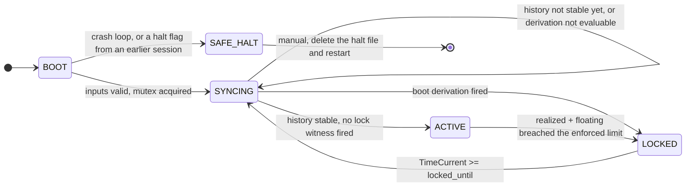
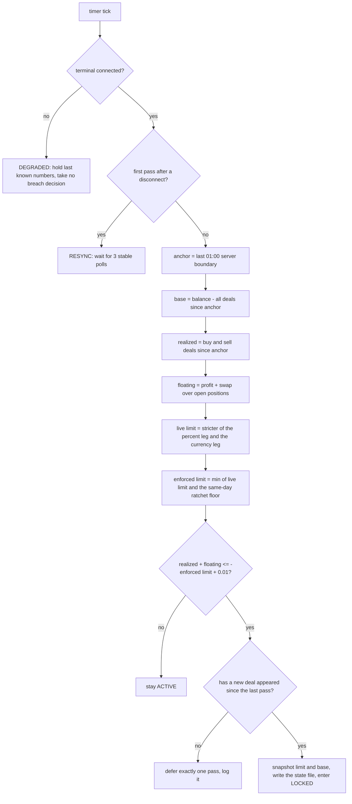

<div align="center">

# AccountGuardian

**Account-level daily loss lockout guardian for MetaTrader 5.**


[English](#english) · [עברית](#hebrew)

</div>

---

<a id="english"></a>

## What it does

* **One daily loss limit for the whole account.** Not per trade, not per strategy, not per magic number. Every position and every deal on the login counts, whatever opened it: another advisor, the desktop terminal, or the phone.
* **Two limit legs, the stricter one wins.** `DailyLossPercent` is a percentage of the day's opening base, `DailyLossCurrency` is a flat amount in account currency. Both are mandatory. Each is picked from a fixed list of values, neither can be switched off, and the smaller of the two is what gets enforced. A value that is not on its own list is refused at startup.
* **The trading day starts at 01:00 server time.** Every measurement window, every rollover, and every lock expiry is anchored to that boundary. It is a compile-time constant, not an input, so no setting can move it.
* **Realized and floating loss are measured together.** Realized is the sum of the day's closed buy and sell deals, profit plus swap plus commission plus fee. Floating is profit plus swap across every open position. A position carried across the rollover counts its floating loss against the day it is still open on.
* **A breach locks the account until the next day anchor.** The lock is written to disk with a snapshot of the limit and base at the moment it fired. The only way out is time: `TimeCurrent >= locked_until`. There is no manual override, no input that shortens it, and no reconnect that clears it.
* **The limit ratchets down, never up, inside a day.** Lowering the limit mid-day takes effect immediately. Raising it does not: the tightest limit seen since the day anchor is held and enforced, and the raise is logged loudly. The floor resets on its own at the next 01:00 anchor.
* **It survives restarts by rebuilding from broker history.** After a restart the advisor replays the day's deals from the server and re-derives whether it should be locked, so killing the terminal, deleting its state file, or both does not hand back a fresh daily allowance.

### What it does not do yet

**This build detects and locks. It sends no order.** When a breach fires, the state machine enters `LOCKED`, alerts, and writes the lock to disk, and your open positions stay exactly where they are until you close them by hand. Floating loss keeps moving while locked. The flatten engine that would delete pending orders and close positions is the next enforcement phase and has not shipped: `Sweep.mqh` currently holds its contract as declarations and comments, and the whole build contains no trade API call anywhere, which is checkable with a grep.

Treat it as a loud, unbypassable stop signal, not as an automatic hand on the close button.

<!-- screenshot: terminal with the advisor attached to a chart, banner visible in the top left corner -->

---

## States



| State | Meaning |
|---|---|
| `BOOT` | Before the first transition. Inputs are validated here, and a malformed core input refuses startup outright with a dated `REFUSED` banner left on the chart. |
| `SYNCING` | Waiting for the broker's deal history to settle. Leaving requires 3 consecutive stable, connected polls of the deal count. No breach decision is ever taken from this state. |
| `ACTIVE` | Measuring. One evaluation pass per timer tick. |
| `LOCKED` | A breach is in force. Positions stay open, no order is sent, the expiry clock is the only exit. |
| `SAFE_HALT` | The advisor believes its own environment is broken, typically a crash loop. It closes nothing, sweeps nothing, and is excluded from expiry. Resume is manual: stop the advisor, delete the halt file, restart. |

**The two paths out of `LOCKED` both go through `SYNCING`.** An ordinary expiry lands in `SYNCING` so that the first pass eligible to declare a new breach is preceded by the same history-stability discipline a cold boot runs. And if the day's history still shows a breach, the boot derivation fires again on the way through and re-locks immediately. That is the boot-derived re-lock: `LOCKED → SYNCING → LOCKED` inside a few seconds, with no `ACTIVE` pass in between. It is the mechanism working, not a defect.

Restart recovery weighs three independent witnesses at the `SYNCING` exit and the **strictest wins**:

1. **The state file** on disk, `AccountGuardian\state_<login>.dat`, carrying the reason, the expiry, and the breach snapshot.
2. **A terminal global variable** mirror, `AG_LOCK_<login>`, rewritten from memory every tick while `ACTIVE` or `LOCKED`, so clearing it by hand is undone within a second. While `SYNCING` it is left untouched, so the value a fresh start inherits is still there when the witness reads it, and the value found at startup is journaled as `lock GV mirror at init`.
3. **A replay of the broker's deal history** since the day anchor. This one is the authority, because it lives on the server and a local machine cannot forge or delete it. The replay walks the day's deals in order and tracks the running minimum of cumulative realized PnL, so a loss that breached and then recovered still locks: the dip is what counts, not the final total.

A witness can only add a lock, never remove one. If history cannot be read, the pass is declared not evaluable and the advisor stays in `SYNCING` for another pass, rather than reading a failed read as "no deals, therefore no breach".

---

## One evaluation pass



Three details in that diagram are worth spelling out.

**The base is rebuilt every pass, never cached.** It is the current account balance minus every deal booked since the anchor, trading and balance deals alike. A deposit raises the balance and raises the deal sum by the same amount, so it cancels out and cannot quietly enlarge the amount you are allowed to lose that day. A withdrawal cancels out the same way.

**A one cent epsilon errs toward breach.** The comparison is `pnl <= -limit + 0.01`, so a loss that lands exactly on the limit is treated as a breach rather than as headroom.

**A breach with no new deal visible is deferred exactly one pass.** This is the only delay in the path, it is bounded at one pass, and it exists so that a momentary incoherence between the position list and the deal history cannot fire a lock on numbers that are about to change. The second pass locks regardless.

---

## Installation

**Requirements:** MetaTrader 5 on Windows. One terminal, one account, one chart. Scope is the entire account, so there is no symbol filter and no magic number filter.

1. **Copy the source into the terminal data folder.** In the terminal, `File → Open Data Folder`, then copy `MQL5/Experts/AccountGuardian/` and `MQL5/Include/AccountGuardian/` into the matching folders there, keeping the same paths.
2. **Compile.** Open `MQL5/Experts/AccountGuardian/AccountGuardian.mq5` in MetaEditor and press F7. The build is expected to report zero errors and zero warnings.
3. **Restart the terminal** if it was already running when you copied the files. A running terminal does not pick up files added to its data folder after it started.
4. **Enable algorithmic trading.** The `Algo Trading` button in the terminal toolbar must be green, and `Tools → Options → Expert Advisors` must allow automated trading. The advisor sends no order today, but it needs the same permission to run its timer and its journal, and it needs it to be already in place for the day enforcement ships.
5. **Attach it to exactly one chart.** Any symbol, any timeframe. The measurement is account-wide and does not depend on which chart it sits on. Attaching a second instance on the same account is refused: an instance-level mutex, heartbeat-based, detects the live holder and the second copy declines to start.
6. **Review the inputs in the properties dialog before accepting them.** A malformed core input refuses startup rather than running degraded.

<!-- screenshot: the input properties dialog with the two limit legs filled in -->

### Inputs

| Input | What it means | Default | Safe starting value |
|---|---|---|---|
| `DailyLossPercent` | Daily loss limit as a percentage of the day-anchor base. Picked from a fixed list, 0.25 to 5.50 in steps of 0.25. A value off the list refuses startup. | `5.50` | `2.00` while you are learning what the advisor does on your account |
| `DailyLossCurrency` | Daily loss limit as a flat amount in account currency. Picked from a fixed list, 1 to 10 in steps of 1, then 15 to 200 in steps of 5. When both legs are set the stricter one is enforced. A value off the list refuses startup. | `200` | a hard cash cap you are certain of |
| `WeeklyReportEnabled` | Weekly measurement and reporting. Optional class: a bad value turns the feature off with a warning and startup continues. | `true` | `true` |
| `LogVerbosity` | `Normal` or `Verbose`. Verbose adds diagnostics and never suppresses a transition or proof-of-life line. | `Normal` | `Verbose` for the first few days |

The timer period, the number of stable polls required to leave `SYNCING`, and the two crash-loop bounds are not inputs. They are fixed in the build at 1 second, 3 polls, 3 consecutive unclean sessions and 300 seconds.

The two limit inputs are the core class: a value off either list returns `INIT_PARAMETERS_INCORRECT`, raises an alert naming the field, and leaves a dated `REFUSED` banner on the chart. The advisor never starts half-configured.

### The first journal lines

Open the `Experts` tab of the terminal and you should see something close to this, all prefixed `AG|`:

```
AG|2026.08.17 23:57:59|INFO|init|build=Phase2|account=<login>|server=<your-broker-server>
AG|2026.08.17 23:57:59|INFO|mutex acquire|id_name=AG_ID_<login>|id_set=1|hb_name=AG_HB_<login>|hb_set=1
AG|2026.08.17 23:57:59|TRANSITION|BOOT->SYNCING|boot|weekly=on|timer=1s
AG|2026.08.17 23:57:59|INFO|timer armed|period=1s
AG|2026.08.17 23:57:59|LIFE|state=SYNCING|seconds_in_state=1|waiting_on=history stability poll not yet run this session|server=2026.08.17 23:57:59|local=2026.08.18 00:09:51
AG|2026.08.17 23:57:59|TRANSITION|SYNCING->ACTIVE|history stable|polls=3/3
```

If the last line does not arrive within a few seconds, read the `waiting_on` field of the `LIFE` lines: it names what is blocking. If instead you get `SYNCING->LOCKED|boot derivation`, the advisor found an unexpired lock or replayed a breach out of today's history, and it is doing its job.

---

## Daily operation

### Reading a LIFE line

A proof-of-life line is emitted every 30 seconds in every state, at any verbosity, and it is never rate-limited away. A healthy guardian and a stuck one must never look identical from outside. In `ACTIVE` it carries the governing numbers:

```
AG|2026.08.17 23:57:59|LIFE|state=ACTIVE|seconds_in_state=3478|waiting_on=-|anchor=2026.08.17 01:00:00|realized=0.00|floating=0.00|base=2133.13|limit=106.66|pnl_vs_limit=0.00 vs -106.66|server=2026.08.17 23:57:59|local=2026.08.18 00:00:17
```

| Field | What it tells you |
|---|---|
| `state` | Current state. |
| `seconds_in_state` | Wall clock time in that state, so it keeps advancing in a dead market. |
| `waiting_on` | What a transitional state is blocked on. `-` when there is nothing to say. Carries `polls=n/3` while syncing, `expiry: TimeCurrent >= locked_until` while locked, and notes such as `quote_age=142s` or `market closed` when the feed has gone quiet. |
| `anchor` | The 01:00 server boundary this window is measured from. |
| `realized` | Closed buy and sell deals since the anchor, profit plus swap plus commission plus fee. |
| `floating` | Profit plus swap across every open position right now. |
| `base` | The day's opening equity base, rebuilt live from balance minus all deals since the anchor. |
| `limit` | The limit in account currency derived from the base and the stricter enabled leg. |
| `pnl_vs_limit` | `realized + floating` against the negated limit. This is the comparison, in the form it is actually made. |
| `server` / `local` | Broker clock and machine clock, side by side. A frozen `server` while `local` advances is a dead market, and it is expected. |

A `DEGRADED|` prefix on the numbers means the terminal was disconnected and these are last known figures, not a fresh evaluation. No breach decision is taken from a disconnected pass, and after reconnect the advisor re-runs the history-stability check before it resumes deciding.

In `LOCKED` the numbers field carries the snapshot and account group instead, so the balance and the equity at any sampled instant inside a locked window are readable from the journal alone:

```
AG|...|LIFE|state=LOCKED|seconds_in_state=2121|waiting_on=expiry: TimeCurrent >= locked_until|locked_until=2026.08.19 01:00:00|limit_snap=106.66|base_snap=2133.13|balance=2034.73|floating=-9.10|equity=2025.63|server=...|local=...
```

| Field | What it tells you |
|---|---|
| `locked_until` | When the lock expires, on the broker clock. |
| `limit_snap` | The limit snapshotted at the breach. This is the figure the locked window is judged by; a limit changed while locked is ignored and journaled. |
| `base_snap` | The day base snapshotted at the breach. |
| `balance` | Account balance right now. |
| `floating` | Profit plus swap across every open position right now. |
| `equity` | `balance + floating`. |

A `DEGRADED|` prefix on the `LOCKED` group means the terminal was disconnected when the line was written, so `balance` and `floating` are the platform's last known figures. A lock declared after a corrupt state file carries `limit_snap=0.00` and `base_snap=0.00`, because that lock has no trustworthy snapshot. The breach instant itself is not on the line; it is on the transition line and in the state file. While locked the advisor walks no deal history; the group is two platform reads and one pass over the open positions.

<!-- screenshot: the Experts tab showing a run of ACTIVE LIFE lines with the numbers field -->

### At a breach

Four lines and a popup, in this order:

```
AG|...|INFO|breach arithmetic|realized=-98.40|floating=-9.10|base=2133.13|limit=106.66|pnl=-107.50
AG|...|INFO|lock bounds|breach_time=2026.08.18 09:41:12|quote_frozen=0|latch_floor=2026.08.19 01:00:00|locked_until=2026.08.19 01:00:00
AG|...|TRANSITION|ACTIVE->LOCKED|DAILY_BREACH|pnl=-107.50|limit=106.66|locked_until=2026.08.19 01:00:00
AG|...|ALERT|DAILY_BREACH: account LOCKED until 2026.08.19 01:00:00 (pnl=-107.50 limit=106.66).
```

The alert is a real MetaTrader popup, not just a journal line. `breach arithmetic` is the full working, so the figure that locked you can always be reconstructed afterwards.

<!-- screenshot: the DAILY_BREACH alert popup over the chart -->

### What LOCKED means

* **Your positions stay open.** No order is sent. Nothing is closed, nothing is deleted, and floating loss keeps moving. Closing out is your decision and your click, and that is the shipped behaviour of this build rather than a bug.
* **The limit and base at the moment of breach are snapshotted**, and the locked window is judged by that snapshot. Changing `DailyLossPercent` or `DailyLossCurrency` while locked changes nothing: the change is logged as ignored, naming both the old and the new value, and the snapshot continues to govern.
* **Deleting the state file while the advisor is alive changes nothing**, because enforcement runs from memory. Clearing the global variable changes nothing either, because it is rewritten from memory on the next tick.
* **A restart does not clear it.** The boot derivation weighs all three witnesses and re-locks.

### How the lock releases

Only one comparison releases it: `TimeCurrent >= locked_until`, where `locked_until` is the next 01:00 server anchor after the breach. When it releases, the advisor logs `lock expired`, clears the model, resets its stability counter, and enters `SYNCING`. From there it either goes to `ACTIVE` for a fresh day, or, if today's history still carries the breach, straight back to `LOCKED`.

Two things can make a lock last longer than you expect, both deliberate:

* **The broker clock is the only clock allowed in that comparison.** A frozen or backward-stepping server clock delays the unlock, which errs locked. A Friday breach that outlives its computed expiry across a weekend freeze is this behaviour working.
* **A breach declared while the quote feed is frozen locks to the anchor after the next one**, a full extra trading day. Without that rule, a freeze shortly before 01:00 would produce a lock that expired minutes later at the reopen.

---

## Roadmap

| Stage | What it covers | Status |
|---|---|---|
| Phase 0 | Skeleton: event wiring, state machine shell, persistence, single-instance mutex, crash-loop detection, logging contract. No trade API reference anywhere in the build. | **Done** |
| Phase 1 | PnL engine: day anchor, base identity, realized whitelist, floating, limit derivation, history stability, degraded and resync handling. | **Done** |
| Phase 2 | Lock state machine: breach declaration, lock snapshot, expiry, boot derivation from three witnesses, the ratchet floor, observability. | **Done** |
| Phase 3 | Defect fixes completed and verified: expiry routed through `SYNCING`, boot-derived locks persisting a real snapshot, the boot-derived re-lock verified across restarts. | **Done** |
| Next | Realized-peak trailing floor: lock on giving back a day's realized profit, not only on dropping below the opening base. Designed and specified, awaiting deployment. | **Next** |
| Later | Enforcement: delete pending orders and close positions on a lock, with per-position backoff and a retcode logged per attempt. Then richer alerting, then hardening. | **Later** |

---

## FAQ

**Why did it not close my position?**
Because this build does not close anything. It detects the breach, locks the state machine, alerts, and persists the lock. The flatten engine is the next enforcement phase. Until it ships, the advisor is a stop signal you still have to act on.

**I raised my daily limit at midday and the advisor is still using the old, smaller one. Why?**
That is the ratchet, and it is the point of it. Inside a trading day the enforced limit is the smallest value seen since the 01:00 anchor. Lowering it applies at once; raising it is held and logged with a warning naming both figures. Otherwise a bad afternoon could be survived by simply typing a bigger number, which is the exact behaviour the guardian exists to prevent. The floor resets on its own at the next 01:00 anchor, so tomorrow starts from whatever the inputs say then.

**What happens if the terminal restarts in the middle of the day?**
On startup the advisor waits for the broker's deal history to settle, then replays the day's deals since the 01:00 anchor and re-derives the answer, alongside its own state file and its global variable mirror. If the day breached, it locks again, and it does so even if the breach had recovered by the time you restarted, because the replay tracks the running minimum rather than the final total. If history cannot be read, it stays in `SYNCING` and keeps trying rather than concluding that nothing happened.

**Can I clear a lock by deleting the state file, or by reinstalling?**
Not by itself. The state file and the global variable are accelerators, so recognition is instant without a full replay. The authority is the broker's own deal history, which is server-side. Deleting local files while the inputs are untouched leaves the history witness fully able to re-derive the lock. Deleting local files *and* inflating the limit inputs is a known residual gap, stated here rather than hidden, and the ratchet floor narrows it inside the same day.

**Should I run this on a demo account first?**
Yes. Run it on demo for at least a full trading day, ideally across a weekend, and read the journal. You want to see the day rollover at 01:00, a `SYNCING → ACTIVE` transition after a restart, and the `LIFE` numbers tracking your own account. The behaviour is identical on live, but the consequences of a misconfigured limit are not.

**The `server` timestamp in the journal is frozen while `local` keeps moving. Is it broken?**
No. `server` is the broker's clock and it stops updating when the market is closed or the feed is quiet. Only `local` is guaranteed to keep advancing, which is why the proof-of-life line carries both. When a quiet feed lasts more than two minutes during an open session, the `waiting_on` field says so with a `quote_age` note; when the session is simply closed it says `market closed` instead.

**Does it work if I trade from my phone, or from another advisor?**
Yes. The measurement is account-wide, taken from broker deal history and the account's open positions. It has no idea what opened them and does not care.

---

## License and disclaimer

Released for **educational use**. Use it at your own risk.

This software is provided as is, with no warranty of any kind. Nothing here is financial advice. Trading carries risk of loss, and a risk tool of any kind, this one included, can fail, be misconfigured, or be defeated by conditions its author did not anticipate. You remain responsible for your own account.

<br />

***

<div align="center">

<a id="hebrew"></a>

# AccountGuardian

**שומר נעילה יומי ברמת החשבון כולו עבור מטא טריידר 5.**

</div>

## מה זה עושה

* **מגבלת הפסד יומית אחת לחשבון כולו.** לא לכל עסקה, לא לכל אסטרטגיה, לא לפי מספר קסם. כל פוזיציה וכל עסקה בחשבון נספרות, לא משנה מי פתח אותן: יועץ אחר, הטרמינל בשולחן העבודה, או הטלפון.
* **שתי רגלי מגבלה, המחמירה מנצחת.** הקלט `DailyLossPercent` הוא אחוז מבסיס פתיחת היום, והקלט `DailyLossCurrency` הוא סכום קבוע במטבע החשבון. שתי הרגליים הן חובה. כל אחת נבחרת מתוך רשימת ערכים קבועה, אי אפשר לכבות אף אחת מהן, והקטנה מבין השתיים היא זו שנאכפת. ערך שאינו נמצא ברשימה שלו נדחה בעלייה.
* **יום המסחר מתחיל בשעה 01:00 בשעון השרת.** כל חלון מדידה, כל גלגול יום וכל פקיעת נעילה מעוגנים לגבול הזה. זהו קבוע בזמן הידור ולא קלט, כך שאף הגדרה אינה יכולה להזיז אותו.
* **הפסד ממומש והפסד צף נמדדים יחד.** הממומש הוא סכום עסקאות הקנייה והמכירה שנסגרו היום, רווח ועוד עמלת החלפה ועוד עמלה ועוד אגרה. הצף הוא רווח ועוד עמלת החלפה על פני כל הפוזיציות הפתוחות. פוזיציה שנשארת פתוחה מעבר לגלגול היום נספרת ליום שבו היא עדיין פתוחה.
* **חריגה נועלת את החשבון עד עוגן היום הבא.** הנעילה נכתבת לדיסק יחד עם תצלום של המגבלה ושל הבסיס ברגע שהיא נורתה. הדרך היחידה החוצה היא זמן: `TimeCurrent >= locked_until`. אין עקיפה ידנית, אין קלט שמקצר אותה, ואין התחברות מחדש שמנקה אותה.
* **המגבלה מתהדקת בלבד בתוך היום.** הורדת המגבלה באמצע היום נכנסת לתוקף מיד. העלאה שלה לא: הערך ההדוק ביותר שנצפה מאז עוגן היום נשמר ונאכף, וההעלאה נרשמת ביומן בקול רם. הרצפה מתאפסת מעצמה בעוגן 01:00 הבא.
* **הוא שורד הפעלות מחדש בשחזור מהיסטוריית הברוקר.** אחרי הפעלה מחדש היועץ משחזר את עסקאות היום מהשרת ומסיק מחדש אם עליו להיות נעול, כך שסגירת הטרמינל, מחיקת קובץ המצב שלו, או שניהם, אינם מחזירים לך מכסת הפסד חדשה.

### מה הוא עדיין אינו עושה

**הבנייה הזו מזהה ונועלת. היא אינה שולחת פקודה.** כשחריגה נורית, מכונת המצבים נכנסת ל`LOCKED`, מתריעה, וכותבת את הנעילה לדיסק, והפוזיציות הפתוחות שלך נשארות בדיוק היכן שהן עד שתסגור אותן ידנית. ההפסד הצף ממשיך לזוז גם בזמן נעילה. מנוע הסגירה שימחק פקודות ממתינות ויסגור פוזיציות הוא שלב האכיפה הבא והוא טרם נשלח: הקובץ `Sweep.mqh` מחזיק כרגע את החוזה שלו בהצהרות ובהערות בלבד, וכל הבנייה אינה מכילה שום קריאה לממשק המסחר, דבר שניתן לבדוק בחיפוש טקסט פשוט.

התייחס לזה כאל תמרור עצור רועש שאי אפשר לעקוף, ולא כאל יד אוטומטית על כפתור הסגירה.

<!-- screenshot: terminal with the advisor attached to a chart, banner visible in the top left corner -->

---

## מצבים


| מצב | משמעות |
|---|---|
| `BOOT` | לפני המעבר הראשון. הקלטים נבדקים כאן, וקלט ליבה פגום דוחה את העלייה לחלוטין ומשאיר על הגרף כרזת `REFUSED` נושאת תאריך. |
| `SYNCING` | המתנה להתייצבות היסטוריית העסקאות של הברוקר. היציאה מחייבת שלוש דגימות יציבות ורצופות של מונה העסקאות. שום החלטת חריגה אינה מתקבלת מהמצב הזה. |
| `ACTIVE` | מדידה. מעבר הערכה אחד בכל פעימת שעון. |
| `LOCKED` | חריגה בתוקף. הפוזיציות נשארות פתוחות, שום פקודה אינה נשלחת, ושעון הפקיעה הוא היציאה היחידה. |
| `SAFE_HALT` | היועץ מאמין שהסביבה שלו שבורה, בדרך כלל בעקבות לולאת קריסות. הוא אינו סוגר דבר, אינו סורק דבר, ואינו נכלל בפקיעה. החזרה לפעילות ידנית: לעצור את היועץ, למחוק את קובץ העצירה, ולהפעיל מחדש. |

**שני המסלולים החוצה מ`LOCKED` עוברים דרך `SYNCING`.** פקיעה רגילה נוחתת ב`SYNCING`, כדי שלמעבר הראשון הרשאי להכריז על חריגה חדשה יקדם אותו משטר יציבות היסטוריה שעלייה קרה מריצה. ואם היסטוריית היום עדיין מראה חריגה, גזירת העלייה נורית שוב בדרך ונועלת מיד. זהו מנגנון הנעילה מחדש בעלייה: `LOCKED → SYNCING → LOCKED` בתוך שניות ספורות, בלי אף מעבר `ACTIVE` באמצע. זו המערכת עובדת, לא תקלה.

שחזור אחרי הפעלה מחדש שוקל שלושה עדים בלתי תלויים ביציאה מ`SYNCING`, **והמחמיר מנצח**:

1. **קובץ המצב** בדיסק, `AccountGuardian\state_<login>.dat`, הנושא את הסיבה, את מועד הפקיעה ואת תצלום החריגה.
2. **משתנה גלובלי של הטרמינל** בשם `AG_LOCK_<login>`, הנכתב מחדש מהזיכרון בכל פעימה במצבים `ACTIVE` ו`LOCKED`, כך שמחיקה ידנית שלו מבוטלת בתוך שנייה. במצב `SYNCING` הוא אינו נכתב כלל, כך שהערך שהפעלה טרייה ירשה עדיין נמצא שם כשהעד קורא אותו, והערך שנמצא בעלייה נרשם ביומן בשורה `lock GV mirror at init`.
3. **שחזור היסטוריית העסקאות של הברוקר** מאז עוגן היום. זהו העד הסמכותי, כי הוא יושב בשרת ומכונה מקומית אינה יכולה לזייף או למחוק אותו. השחזור עובר על עסקאות היום לפי הסדר ועוקב אחר המינימום הרץ של הרווח וההפסד הממומש המצטבר, כך שהפסד שחרג ואחר כך התאושש עדיין נועל: מה שקובע הוא השפל, לא הסכום הסופי.

עד יכול רק להוסיף נעילה, לעולם לא להסיר אחת. אם אי אפשר לקרוא את ההיסטוריה, המעבר מוכרז כבלתי ניתן להערכה והיועץ נשאר ב`SYNCING` למעבר נוסף, במקום לקרוא כישלון קריאה כאילו פירושו שאין עסקאות ולכן אין חריגה.

---

## מעבר הערכה אחד


שלושה פרטים בתרשים הזה ראויים לפירוט.

**הבסיס נבנה מחדש בכל מעבר ולעולם אינו נשמר במטמון.** הוא יתרת החשבון הנוכחית פחות כל עסקה שנרשמה מאז העוגן, עסקאות מסחר ועסקאות יתרה כאחד. הפקדה מעלה את היתרה ומעלה את סכום העסקאות באותו סכום בדיוק, ולכן היא מתקזזת ואינה יכולה להגדיל בשקט את הסכום שמותר לך להפסיד באותו יום. משיכה מתקזזת באותו אופן.

**סטייה של אגורה אחת מטה את ההכרעה לכיוון החריגה.** ההשוואה היא `pnl <= -limit + 0.01`, כך שהפסד שנוחת בדיוק על המגבלה נחשב חריגה ולא מרווח נשימה.

**חריגה שאין מולה עסקה חדשה נדחית במעבר אחד בדיוק.** זהו העיכוב היחיד במסלול, הוא חסום במעבר אחד, והוא קיים כדי שחוסר עקביות רגעי בין רשימת הפוזיציות להיסטוריית העסקאות לא יירה נעילה על מספרים שעומדים להשתנות. המעבר השני נועל בכל מקרה.

---

## התקנה

**דרישות:** מטא טריידר 5 על חלונות. טרמינל אחד, חשבון אחד, גרף אחד. ההיקף הוא החשבון כולו, ולכן אין סינון לפי סימול ואין סינון לפי מספר קסם.

1. **העתק את המקור לתיקיית הנתונים של הטרמינל.** בטרמינל, `File → Open Data Folder`, ואז העתק את `MQL5/Experts/AccountGuardian/` ואת `MQL5/Include/AccountGuardian/` לתיקיות המקבילות שם, תוך שמירה על אותם נתיבים.
2. **הדר.** פתח את `MQL5/Experts/AccountGuardian/AccountGuardian.mq5` בעורך `MetaEditor` והקש F7. הבנייה אמורה לדווח על אפס שגיאות ואפס אזהרות.
3. **הפעל מחדש את הטרמינל** אם הוא כבר רץ בזמן העתקת הקבצים. טרמינל שרץ אינו קולט קבצים שנוספו לתיקיית הנתונים שלו אחרי שעלה.
4. **אפשר מסחר אלגוריתמי.** הכפתור `Algo Trading` בסרגל הכלים חייב להיות ירוק, והמסלול `Tools → Options → Expert Advisors` חייב להתיר מסחר אוטומטי. היועץ אינו שולח פקודה היום, אך הוא זקוק לאותה הרשאה כדי להריץ את השעון ואת היומן שלו, וכדי שההרשאה כבר תהיה במקומה ביום שבו האכיפה תישלח.
5. **חבר אותו לגרף אחד בלבד.** כל סימול, כל מסגרת זמן. המדידה היא ברמת החשבון ואינה תלויה בגרף שעליו הוא יושב. חיבור מופע שני על אותו חשבון נדחה: מנעול מופע מבוסס פעימות לב מזהה את המחזיק החי, והעותק השני מסרב לעלות.
6. **עבור על הקלטים בחלון המאפיינים לפני אישורם.** קלט ליבה פגום דוחה את העלייה במקום לרוץ במצב מוחלש.

<!-- screenshot: the input properties dialog with the two limit legs filled in -->

### קלטים

| קלט | מה זה אומר | ברירת מחדל | ערך התחלה בטוח |
|---|---|---|---|
| `DailyLossPercent` | מגבלת הפסד יומית כאחוז מבסיס עוגן היום. נבחרת מתוך רשימה קבועה, בטווח 0.25 עד 5.50 בצעדים של 0.25. ערך שאינו ברשימה דוחה את העלייה. | `5.50` | `2.00` כל עוד אתה לומד כיצד היועץ מתנהג על החשבון שלך |
| `DailyLossCurrency` | מגבלת הפסד יומית כסכום קבוע במטבע החשבון. נבחרת מתוך רשימה קבועה, בטווח 1 עד 10 בצעדים של 1, ואחר כך 15 עד 200 בצעדים של 5. כששתי הרגליים מוגדרות, המחמירה נאכפת. ערך שאינו ברשימה דוחה את העלייה. | `200` | תקרת מזומן קשיחה שאתה בטוח בה |
| `WeeklyReportEnabled` | מדידה ודיווח שבועיים. מחלקה אופציונלית: ערך פגום מכבה את התכונה עם אזהרה, והעלייה נמשכת. | `true` | `true` |
| `LogVerbosity` | הערך `Normal` או `Verbose`. המצב המפורט מוסיף אבחון ולעולם אינו מדכא שורת מעבר או שורת אות חיים. | `Normal` | `Verbose` בימים הראשונים |

מחזור השעון, מספר הדגימות היציבות הנדרשות ליציאה מ`SYNCING`, ושני גבולות לולאת הקריסות אינם קלטים. הם קבועים בבנייה על שנייה אחת, שלוש דגימות, שלוש עליות לא נקיות רצופות ושלוש מאות שניות.

שני קלטי המגבלה הם מחלקת הליבה: ערך שאינו נמצא באחת הרשימות מחזיר `INIT_PARAMETERS_INCORRECT`, מרים התראה שנוקבת בשם השדה, ומשאיר על הגרף כרזת `REFUSED` נושאת תאריך. היועץ לעולם אינו עולה מוגדר למחצה.

### שורות היומן הראשונות

פתח את לשונית `Experts` בטרמינל, ואמורות להופיע שורות קרובות לאלה, כולן בקידומת `AG|`:

```
AG|2026.08.17 23:57:59|INFO|init|build=Phase2|account=<login>|server=<your-broker-server>
AG|2026.08.17 23:57:59|INFO|mutex acquire|id_name=AG_ID_<login>|id_set=1|hb_name=AG_HB_<login>|hb_set=1
AG|2026.08.17 23:57:59|TRANSITION|BOOT->SYNCING|boot|weekly=on|timer=1s
AG|2026.08.17 23:57:59|INFO|timer armed|period=1s
AG|2026.08.17 23:57:59|LIFE|state=SYNCING|seconds_in_state=1|waiting_on=history stability poll not yet run this session|server=2026.08.17 23:57:59|local=2026.08.18 00:09:51
AG|2026.08.17 23:57:59|TRANSITION|SYNCING->ACTIVE|history stable|polls=3/3
```

אם השורה האחרונה אינה מגיעה בתוך שניות ספורות, קרא את השדה `waiting_on` בשורות ה`LIFE`: הוא נוקב במה שחוסם. אם במקומה מתקבלת השורה `SYNCING->LOCKED|boot derivation`, היועץ מצא נעילה שלא פקעה או שחזר חריגה מתוך היסטוריית היום, והוא עושה את עבודתו.

---

## הפעלה יומית

### קריאת שורת LIFE

שורת אות חיים נפלטת כל שלושים שניות בכל מצב, בכל רמת פירוט, ולעולם אינה מוגבלת בקצב. שומר תקין ושומר תקוע אינם יכולים להיראות זהים מבחוץ. במצב `ACTIVE` היא נושאת את המספרים הקובעים:

```
AG|2026.08.17 23:57:59|LIFE|state=ACTIVE|seconds_in_state=3478|waiting_on=-|anchor=2026.08.17 01:00:00|realized=0.00|floating=0.00|base=2133.13|limit=106.66|pnl_vs_limit=0.00 vs -106.66|server=2026.08.17 23:57:59|local=2026.08.18 00:00:17
```

| שדה | מה הוא מספר לך |
|---|---|
| `state` | המצב הנוכחי. |
| `seconds_in_state` | זמן שעון קיר במצב הזה, כך שהוא ממשיך להתקדם גם בשוק מת. |
| `waiting_on` | מה חוסם מצב מעבר. הערך `-` כשאין מה לומר. נושא `polls=n/3` בזמן סנכרון, `expiry: TimeCurrent >= locked_until` בזמן נעילה, והערות כמו `quote_age=142s` או `market closed` כשהזרם השתתק. |
| `anchor` | גבול השעה 01:00 בשעון השרת שממנו נמדד החלון הזה. |
| `realized` | עסקאות קנייה ומכירה שנסגרו מאז העוגן, רווח ועוד עמלת החלפה ועוד עמלה ועוד אגרה. |
| `floating` | רווח ועוד עמלת החלפה על פני כל הפוזיציות הפתוחות ברגע זה. |
| `base` | בסיס ההון של פתיחת היום, נבנה חי מהיתרה פחות כל העסקאות מאז העוגן. |
| `limit` | המגבלה במטבע החשבון, נגזרת מהבסיס ומהרגל המחמירה מבין הפעילות. |
| `pnl_vs_limit` | הסכום `realized + floating` מול המגבלה בסימן שלילי. זו ההשוואה עצמה, בצורה שבה היא נעשית בפועל. |
| `server` / `local` | שעון הברוקר ושעון המכונה, זה לצד זה. שעון `server` קפוא בזמן ש`local` מתקדם פירושו שוק מת, וזה צפוי. |

הקידומת `DEGRADED|` על המספרים פירושה שהטרמינל היה מנותק ואלה נתונים אחרונים ידועים, לא הערכה טרייה. שום החלטת חריגה אינה מתקבלת ממעבר מנותק, ואחרי החיבור מחדש היועץ מריץ שוב את בדיקת יציבות ההיסטוריה לפני שהוא חוזר להכריע.

במצב `LOCKED` שדה המספרים נושא במקום זאת את קבוצת התצלום והחשבון, כך שהיתרה וההון בכל רגע דגום בתוך חלון נעול ניתנים לקריאה מהיומן לבדו:

```
AG|...|LIFE|state=LOCKED|seconds_in_state=2121|waiting_on=expiry: TimeCurrent >= locked_until|locked_until=2026.08.19 01:00:00|limit_snap=106.66|base_snap=2133.13|balance=2034.73|floating=-9.10|equity=2025.63|server=...|local=...
```

| שדה | מה הוא מספר לך |
|---|---|
| `locked_until` | מועד פקיעת הנעילה, בשעון הברוקר. |
| `limit_snap` | המגבלה שצולמה ברגע החריגה. זהו הנתון שלפיו נשפט חלון הנעילה; שינוי מגבלה בזמן נעילה מתעלמים ממנו ורושמים אותו ביומן. |
| `base_snap` | בסיס היום שצולם ברגע החריגה. |
| `balance` | יתרת החשבון ברגע זה. |
| `floating` | רווח ועוד עמלת החלפה על פני כל הפוזיציות הפתוחות ברגע זה. |
| `equity` | הסכום `balance + floating`. |

הקידומת `DEGRADED|` על קבוצת `LOCKED` פירושה שהטרמינל היה מנותק כשהשורה נכתבה, ולכן `balance` ו`floating` הם הנתונים האחרונים הידועים לפלטפורמה. נעילה שהוכרזה אחרי קובץ מצב פגום נושאת `limit_snap=0.00` ו`base_snap=0.00`, כי לנעילה כזו אין תצלום אמין. רגע החריגה עצמו אינו מופיע בשורה; הוא נמצא בשורת המעבר ובקובץ המצב. בזמן נעילה היועץ אינו עובר על היסטוריית העסקאות; הקבוצה היא שתי קריאות מהפלטפורמה ומעבר אחד על הפוזיציות הפתוחות.

<!-- screenshot: the Experts tab showing a run of ACTIVE LIFE lines with the numbers field -->

### ברגע החריגה

ארבע שורות וחלון קופץ, בסדר הזה:

```
AG|...|INFO|breach arithmetic|realized=-98.40|floating=-9.10|base=2133.13|limit=106.66|pnl=-107.50
AG|...|INFO|lock bounds|breach_time=2026.08.18 09:41:12|quote_frozen=0|latch_floor=2026.08.19 01:00:00|locked_until=2026.08.19 01:00:00
AG|...|TRANSITION|ACTIVE->LOCKED|DAILY_BREACH|pnl=-107.50|limit=106.66|locked_until=2026.08.19 01:00:00
AG|...|ALERT|DAILY_BREACH: account LOCKED until 2026.08.19 01:00:00 (pnl=-107.50 limit=106.66).
```

ההתראה היא חלון קופץ אמיתי של מטא טריידר, לא רק שורת יומן. השורה `breach arithmetic` היא החישוב המלא, כך שתמיד אפשר לשחזר בדיעבד את המספר שנעל אותך.

<!-- screenshot: the DAILY_BREACH alert popup over the chart -->

### מה פירוש LOCKED

* **הפוזיציות שלך נשארות פתוחות.** שום פקודה אינה נשלחת. שום דבר אינו נסגר, שום דבר אינו נמחק, וההפסד הצף ממשיך לזוז. הסגירה היא ההחלטה שלך והלחיצה שלך, וזו ההתנהגות שנשלחה בבנייה הזו ולא תקלה.
* **המגבלה והבסיס ברגע החריגה מצולמים**, וחלון הנעילה נשפט לפי התצלום הזה. שינוי `DailyLossPercent` או `DailyLossCurrency` בזמן נעילה אינו משנה דבר: השינוי נרשם ביומן כמי שהתעלמו ממנו, בציון הערך הישן והחדש, והתצלום ממשיך לקבוע.
* **מחיקת קובץ המצב בזמן שהיועץ חי אינה משנה דבר**, כי האכיפה רצה מהזיכרון. גם מחיקת המשתנה הגלובלי אינה משנה דבר, כי הוא נכתב מחדש מהזיכרון בפעימה הבאה.
* **הפעלה מחדש אינה מנקה אותה.** גזירת העלייה שוקלת את שלושת העדים ונועלת שוב.

### איך הנעילה משתחררת

השוואה אחת בלבד משחררת אותה: `TimeCurrent >= locked_until`, כאשר `locked_until` הוא עוגן 01:00 הבא בשעון השרת אחרי החריגה. כשהיא משתחררת, היועץ רושם `lock expired`, מנקה את המודל, מאפס את מונה היציבות, ונכנס ל`SYNCING`. משם הוא עובר ל`ACTIVE` ליום חדש, או, אם היסטוריית היום עדיין נושאת את החריגה, חוזר ישר ל`LOCKED`.

שני דברים עשויים להאריך נעילה מעבר למצופה, ושניהם מכוונים:

* **שעון הברוקר הוא השעון היחיד המורשה בהשוואה הזו.** שעון שרת קפוא או שנסוג לאחור מעכב את השחרור, וזו טעות לכיוון הבטוח. חריגה ביום שישי ששורדת את מועד הפקיעה המחושב שלה לאורך הקפאת סוף השבוע היא ההתנהגות הזו בפעולה.
* **חריגה שהוכרזה בזמן שזרם הציטוטים קפוא נועלת עד העוגן שאחרי הבא**, יום מסחר שלם נוסף. בלי הכלל הזה, הקפאה זמן קצר לפני 01:00 הייתה מייצרת נעילה שפוקעת דקות אחר כך בפתיחה מחדש.

---

## מפת דרכים

| שלב | מה הוא כולל | סטטוס |
|---|---|---|
| שלב 0 | שלד: חיווט אירועים, מעטפת מכונת מצבים, שמירה לדיסק, מנעול מופע יחיד, זיהוי לולאת קריסות, חוזה הרישום ליומן. שום התייחסות לממשק המסחר בשום מקום בבנייה. | **הושלם** |
| שלב 1 | מנוע רווח והפסד: עוגן יום, זהות הבסיס, רשימת ההיתר של הממומש, הצף, גזירת המגבלה, יציבות היסטוריה, טיפול במצב מוחלש ובסנכרון מחדש. | **הושלם** |
| שלב 2 | מכונת מצבי הנעילה: הכרזת חריגה, תצלום נעילה, פקיעה, גזירת נעילה בעלייה משלושה עדים, רצפת ההתהדקות, נראות. | **הושלם** |
| שלב 3 | תיקוני פגמים שהושלמו ואומתו: ניתוב הפקיעה דרך `SYNCING`, נעילות שנגזרו בעלייה השומרות תצלום אמיתי, ואימות הנעילה מחדש בעלייה לאורך הפעלות מחדש. | **הושלם** |
| הבא בתור | רצפה נגררת של שיא הרווח הממומש: נעילה על החזרת רווח ממומש של יום, ולא רק על ירידה מתחת לבסיס הפתיחה. תוכנן ואופיין, וממתין לפריסה. | **הבא בתור** |
| בהמשך | אכיפה: מחיקת פקודות ממתינות וסגירת פוזיציות בנעילה, עם השהיה מדורגת לכל פוזיציה וקוד תגובה נרשם לכל ניסיון. אחר כך התרעות עשירות יותר, ואז חיסון. | **בהמשך** |

---

## שאלות נפוצות

**למה הוא לא סגר לי את הפוזיציה?**
כי הבנייה הזו אינה סוגרת כלום. היא מזהה את החריגה, נועלת את מכונת המצבים, מתריעה, ושומרת את הנעילה לדיסק. מנוע הסגירה הוא שלב האכיפה הבא. עד שיישלח, היועץ הוא תמרור עצור שאתה עדיין צריך לפעול לפיו.

**העליתי את המגבלה היומית באמצע היום והיועץ עדיין משתמש בישנה, הקטנה יותר. למה?**
זו ההתהדקות, וזו כל מטרתה. בתוך יום מסחר המגבלה הנאכפת היא הערך הקטן ביותר שנצפה מאז עוגן 01:00. הורדה נכנסת לתוקף מיד; העלאה נעצרת ונרשמת עם אזהרה הנוקבת בשני המספרים. אחרת אפשר היה לשרוד צהריים גרועים פשוט בהקלדת מספר גדול יותר, וזו בדיוק ההתנהגות שהשומר קיים כדי למנוע. הרצפה מתאפסת מעצמה בעוגן 01:00 הבא, כך שמחר מתחיל ממה שהקלטים אומרים אז.

**מה קורה אם הטרמינל עולה מחדש באמצע היום?**
בעלייה היועץ ממתין להתייצבות היסטוריית העסקאות של הברוקר, ואז משחזר את עסקאות היום מאז עוגן 01:00 ומסיק מחדש את התשובה, לצד קובץ המצב שלו ומראת המשתנה הגלובלי. אם היום חרג, הוא נועל שוב, וזאת גם אם החריגה כבר התאוששה עד לרגע ההפעלה מחדש, כי השחזור עוקב אחר המינימום הרץ ולא אחר הסכום הסופי. אם אי אפשר לקרוא את ההיסטוריה, הוא נשאר ב`SYNCING` וממשיך לנסות, במקום להסיק ששום דבר לא קרה.

**אפשר לנקות נעילה במחיקת קובץ המצב, או בהתקנה מחדש?**
לא בפני עצמו. קובץ המצב והמשתנה הגלובלי הם מאיצים, כדי שהזיהוי יהיה מיידי בלי שחזור מלא. הסמכות היא היסטוריית העסקאות של הברוקר עצמו, שיושבת בשרת. מחיקת קבצים מקומיים בזמן שהקלטים לא נגעו משאירה את עד ההיסטוריה מסוגל לחלוטין לגזור מחדש את הנעילה. מחיקת קבצים מקומיים יחד עם ניפוח קלטי המגבלה היא פרצה שיורית ידועה, שנאמרת כאן במפורש ואינה מוסתרת, ורצפת ההתהדקות מצמצמת אותה בתוך אותו יום.

**כדאי להריץ את זה קודם על חשבון דמו?**
כן. הרץ אותו על דמו לפחות יום מסחר מלא, רצוי גם לאורך סוף שבוע, וקרא את היומן. אתה רוצה לראות את גלגול היום בשעה 01:00, מעבר `SYNCING → ACTIVE` אחרי הפעלה מחדש, ואת מספרי ה`LIFE` עוקבים אחרי החשבון שלך. ההתנהגות זהה בחשבון חי, אבל ההשלכות של מגבלה שהוגדרה שגוי אינן זהות.

**חותמת הזמן `server` ביומן קפואה בזמן ש`local` ממשיך לזוז. משהו שבור?**
לא. השדה `server` הוא שעון הברוקר והוא מפסיק להתעדכן כשהשוק סגור או כשהזרם שקט. רק `local` מובטח להמשיך להתקדם, ולכן שורת אות החיים נושאת את שניהם. כשזרם שקט נמשך יותר משתי דקות במהלך מושב פתוח, השדה `waiting_on` אומר זאת בהערת `quote_age`; כשהמושב פשוט סגור, הוא אומר `market closed` במקום.

**זה עובד אם אני סוחר מהטלפון, או מיועץ אחר?**
כן. המדידה היא ברמת החשבון, נלקחת מהיסטוריית העסקאות של הברוקר ומהפוזיציות הפתוחות של החשבון. אין לה מושג מי פתח אותן והיא אינה מתעניינת בזה.

---

## רישיון והסרת אחריות

משוחרר **לשימוש לימודי**. השימוש באחריותך בלבד.

התוכנה מסופקת כמות שהיא, ללא אחריות מכל סוג. שום דבר כאן אינו ייעוץ פיננסי. במסחר קיים סיכון להפסד, וכלי לניהול סיכון מכל סוג, זה כולל, עלול להיכשל, להיות מוגדר שגוי, או להיות מנוצח בתנאים שהמפתח לא צפה. האחריות על החשבון שלך נשארת שלך.
