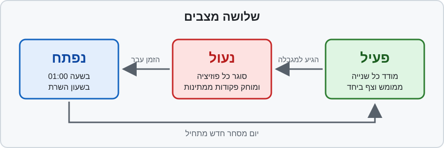
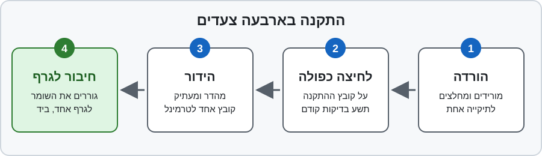
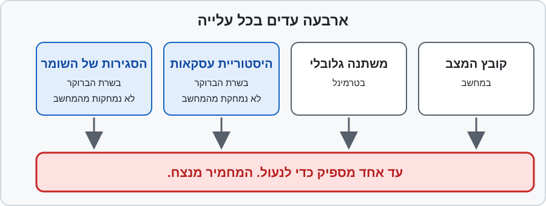

# 🛡️ `AccountGuardian`

מנעול על חשבון המסחר. מגיעים למגבלת ההפסד היומית, והיום נסגר. בלי עקיפה.

  

## 🎬 ככה זה נראה

נעילה אמיתית: ההפסד מגיע למגבלה, הפוזיציות נסגרות, והחשבון נעול עד 01:00.

התקנה: מורידים, לוחצים פעמיים, והמתקין מהדר ומעתיק קובץ אחד לטרמינל.

חיבור לגרף: בכל חיבור ובכל עלייה השומר בודק ארבעה עדים, ורק אז מתחיל למדוד.

## ✋ מה הוא עושה

שלושה כללים, וזהו:

1. 🔒 הגעת למגבלת ההפסד היומית? החשבון ננעל עד השעה 01:00 בשעון השרת.
2. 🧹 נעילה סוגרת כל פוזיציה ומוחקת כל פקודה ממתינה. גם מה שנפתח מהטלפון.
3. 🔁 הפעלה מחדש של הטרמינל או מחיקת קבצים לא משחררות את הנעילה.

המגבלה היא על החשבון כולו. לא על עסקה אחת ולא על אסטרטגיה אחת. כל עסקה נספרת, לא משנה מי פתח אותה: אתה, יועץ אחר או הטלפון.

בוחרים שני ערכים: אחוז מהיתרה בתחילת היום, וסכום קבוע במטבע החשבון. הקטן מביניהם קובע. נספר גם הרווח וההפסד הממומש וגם הצף של הפוזיציות הפתוחות.

יום המסחר מתחיל בשעה 01:00 בשעון השרת. אין הגדרה שמזיזה את זה.

## 🚫 מה הוא אף פעם לא עושה

* לא פותח עסקאות משלו. הוא רק סוגר ומוחק, ורק בזמן נעילה.
* לא נוגע ביועצים אחרים. לא מכבה אותם ולא משנה אותם. בזמן נעילה הוא כן סוגר גם את הפוזיציות שלהם, כי המגבלה היא על כל החשבון.
* לא משתמש ברשת. אין בו שום חיבור משלו לאינטרנט. מה שהוא שולח עובר רק דרך הטרמינל לברוקר שלך: פקודות סגירה ומחיקה, בזמן נעילה.

## 📥 התקנה

צריך חלונות, ומטא טריידר 5 שכבר נפתח לפחות פעם אחת בחשבון החלונות הזה. התקנה בלבד לא מספיקה, כי המתקין מוצא את הטרמינל לפי התיקייה שנוצרת בפתיחה הראשונה.

1. בעמוד המאגר לוחצים `Code` ואז `Download ZIP`.
2. מחלצים את כל הקובץ לתיקייה אחת. לא מריצים כלום מתוך הקובץ הדחוס.
3. סוגרים את מטא טריידר 5 ואת `MetaEditor`. המתקין לא סוגר אותם בשבילך.
4. לחיצה כפולה על `installer\install.cmd`. אם יש כמה טרמינלים, מקלידים את המספר של הטרמינל הנכון.
5. המתקין עובר תשע בדיקות, מהדר את השומר ומעתיק קובץ אחד לטרמינל. כל שלב נרשם בקובץ `installer\install-log.txt`.

אחר כך מחברים את השומר ביד:

1. פותחים את מטא טריידר 5 ומתחברים לחשבון המסחר.
2. הכפתור `Algo Trading` בסרגל הכלים צריך להיות ירוק. בלעדיו הנעילה עדיין מחזיקה, אבל השומר לא יכול לסגור כלום.
3. בחלון `Navigator`, תחת `Expert Advisors`, גוררים את `AccountGuardian` לגרף אחד. כל סימול, כל טווח זמן.
4. בחלון ההגדרות בוחרים את שתי המגבלות. ברירת המחדל היא הערך הגבוה בכל רשימה: `5.50` אחוז ו`200` במטבע החשבון.
5. בלשונית `Experts` קוראים את השורה `limits accepted` לפני שמפעילים מחדש את הטרמינל. אם העלייה נדחתה, הפעלה מחדש עולה בלי שומר בכלל.

## 🔒 מתי הוא נועל, ומה רואים

ברגע שהרווח וההפסד של היום, ממומש וצף ביחד, יורדים עד המגבלה, החשבון ננעל. גם אם סגרת היום עסקאות ברווח ואחר כך החזרת מהשיא יותר מהמגבלה, זה נועל.

מה רואים:

* חלון התראה קופץ בטרמינל, עם שעת השחרור.
* על הגרף מופיע שלט עם המצב `LOCKED`.
* הפוזיציות נסגרות אחת אחרי השנייה, הכי מפסידה קודם, ואחר כך נמחקות הפקודות הממתינות. כל ניסיון נרשם בלשונית `Experts`.

הנעילה נפתחת בשעה 01:00 בשעון השרת, ורק הזמן פותח אותה. אין כפתור ואין הגדרה שמשחררים. אם זרם המחירים היה קפוא ברגע החריגה, היא נמשכת יום מסחר שלם נוסף.

מקרה אחד לא נבנה מחדש, ואומרים את זה בגלוי: נעילה שנורתה על החזרת רווח, כשלא היה מה לסגור או שכל סגירה נחסמה, והרווח הממומש של היום עכשיו מעל שיא היום פחות המגבלה, לא חוזרת אחרי הפעלה מחדש אם נמחקו גם קובץ המצב וגם המשתנה הגלובלי.

## ❓ שאלות ותשובות

**למה הוא לא סגר לי פוזיציה?**
אם החשבון לא נעול, הוא לא סוגר כלום. אם הוא נעול, מסתכלים בלשונית `Experts`. השורה `sweep blocked` אומרת שהמסחר האלגוריתמי כבוי. הערך `class=hold` אומר שהפלטפורמה סירבה, למשל כי השוק סגור, והוא ינסה שוב כשהמצב ישתנה. וכשהטרמינל סגור או מנותק, הוא לא יכול לעשות כלום עד שהוא חוזר.

**העליתי את המגבלה באמצע היום, והוא עדיין על הישנה. למה?**
בכוונה. בתוך היום המגבלה רק יורדת. הורדה נכנסת מיד. העלאה מחכה ל 01:00 הבא ונרשמת עם אזהרה. אחרת כל יום רע היה נגמר בהקלדה של מספר גדול יותר.

**מה קורה אם הטרמינל נופל באמצע היום?**
בעלייה הוא מחכה שהיסטוריית העסקאות תתייצב, עובר מחדש על עסקאות היום מהשרת, ואם היום חרג הוא נועל שוב. גם אם ההפסד כבר התאושש, כי מה שקובע זה השפל ולא הסכום בסוף. גם עסקאות שנעשו מהטלפון בזמן שהטרמינל היה סגור נספרות.

**אפשר לשחרר נעילה במחיקת קבצים או בהתקנה מחדש?**
לא. הקבצים במחשב רק מאיצים את הזיהוי. הסמכות היא היסטוריית העסקאות בשרת של הברוקר, ואותה אי אפשר למחוק מהמחשב. חוץ מהמקרה האחד שכתוב למעלה. מחיקת קבצים יחד עם הגדלת המגבלה היא פרצה ידועה, והמגבלה בכל מקרה לא עולה מעל `5.50` אחוז ו`200`.

**זה עובד גם על מסחר מהטלפון או מיועץ אחר?**
כן. הוא מודד את כל החשבון, לא משנה מי פתח את העסקה.

## 🧪 קודם על דמו

מתקינים קודם על חשבון דמו, ונותנים לו לרוץ לפחות יום מסחר שלם, עדיף גם סוף שבוע. מסתכלים בלשונית `Experts` ורואים את החלפת היום בשעה 01:00, את המעבר מ`SYNCING` ל`ACTIVE` אחרי הפעלה מחדש, ואת המספרים עוקבים אחרי החשבון. וחשוב לדעת: חיבור ראשון לחשבון שכבר עבר היום את המגבלה נועל אותו מיד, וסוגר את כל הפוזיציות בחשבון, גם של יועצים אחרים וגם של הטלפון.

## 🤝 עובד עם

עובד עם כל ברוקר שמציע מטא טריידר 5 על חלונות.

## 📄 רישיון

רישיון `MIT`, הנוסח המלא בקובץ `LICENSE`.

